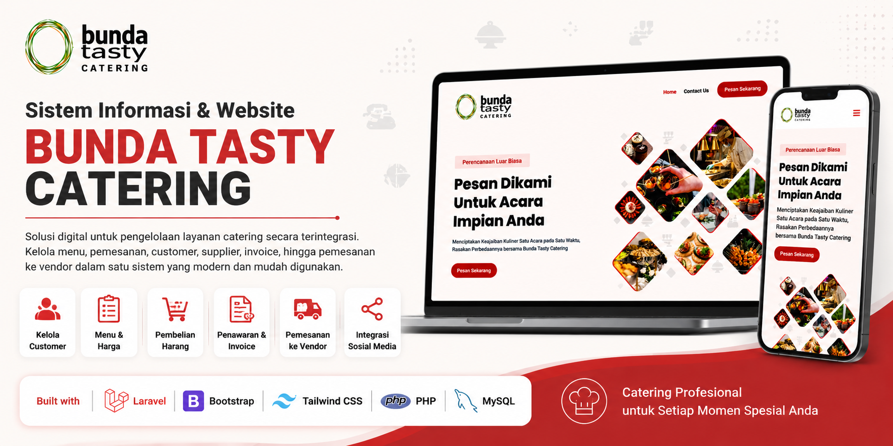
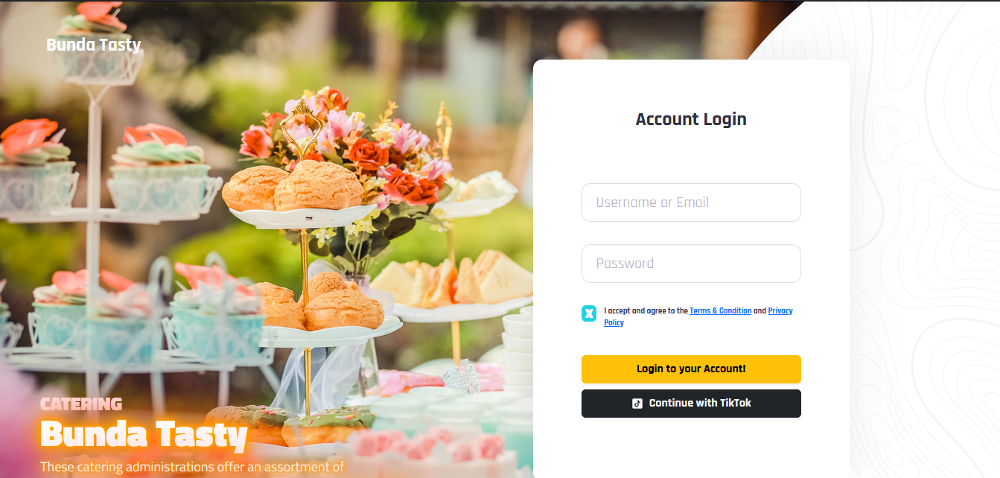
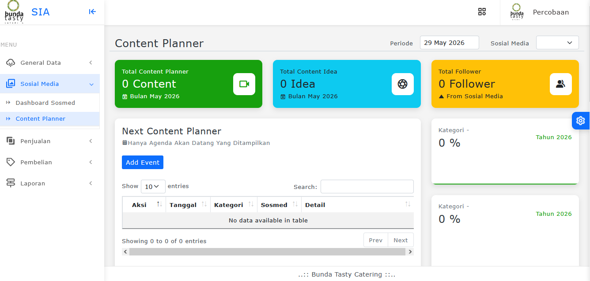
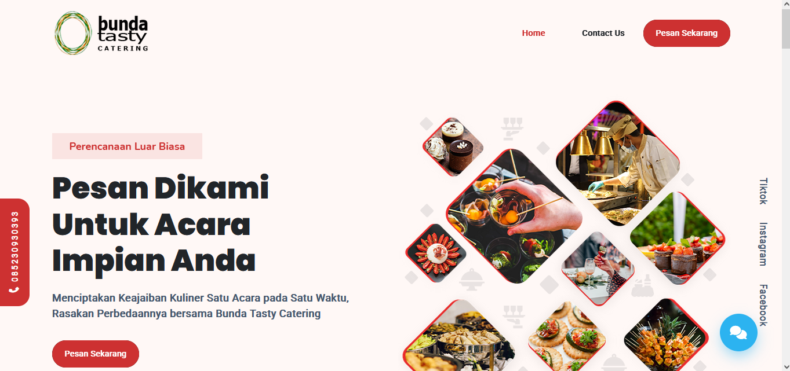
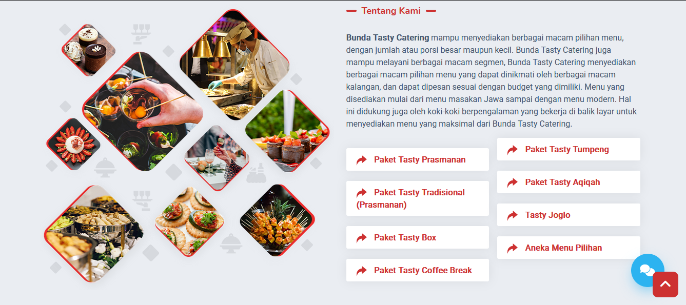

# BUNDA TASTY CATERING (SHOWCASE)
   

  

Aplikasi ini merupakan showcase / demo project yang digunakan untuk portofolio.
Beberapa data dan fitur mungkin tidak sepenuhnya lengkap atau disederhanakan untuk kebutuhan portofolio.

Website company profile dan sistem pemesanan digital Bunda Tasty Catering yang dikembangkan untuk mendukung layanan pemesanan catering secara online, publikasi menu, informasi paket catering, promosi layanan, dan komunikasi pelanggan secara terintegrasi.

---

## Tentang Project

Bunda Tasty Catering merupakan website company profile dan layanan pemesanan catering yang dirancang untuk membantu pelanggan mendapatkan informasi layanan catering secara cepat, modern, dan responsif.

Project ini menyediakan berbagai fitur seperti informasi paket catering, galeri menu, layanan pemesanan, kontak pelanggan, hingga tampilan responsif yang dapat diakses melalui desktop maupun perangkat mobile.

---

## Fitur Utama

* Company Profile Catering
* Daftar COA (Chart of Account)
* Dashboard Manajemen
* Integrasi Sosial Media
* Invoice dan Tagihan
* Manajemen Customer
* Manajemen Supplier
* Menu dan Harga Catering
* Pembelian Barang
* Penawaran Catering

---

## Teknologi yang Digunakan

* PHP
* Laravel Framework
* MySQL
* Bootstrap
* JavaScript

---

## Screenshot

### Login Page

  

### Dashboard

  

### COMPANY PROFILE

  

  

---

## Status

Project ini digunakan sebagai media branding digital dan sistem informasi layanan catering profesional.
